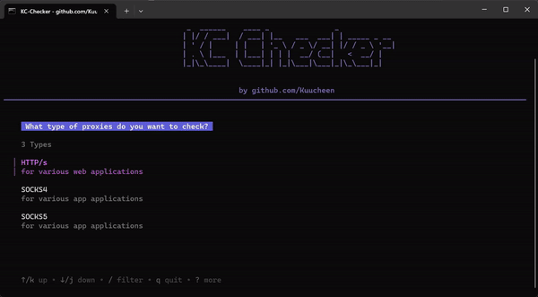

---
# 
KC Checker

Experience the speed of a blazingly fast proxy checker

where checking is done with style 

 

<!---->

 

 

-----

### 
Features

- Multi-Threaded
- Keyword website check
- Verify whether the proxy can access a specific website
- Sleek and intuitive UI for a beautiful user experience
- Highly customizable settings to tailor the tool to your needs

 

-----

### 
Getting started

Install [go](https://go.dev/doc/install)

**Run**

  
Using provided scripts

  
  ### Windows
  
  Double click on `start.bat`

  ### Linux

  Open directory in terminal and type `./start.sh`

  
Using terminal

  Navigate to your directory
        
    cd your-directory
 
  Install dependencies
  
    go get .

  Run with
  
    go run .

---

### 
Customize Settings

Note: Normally you don't have to change these settings

    
Details for settings.txt

1. **threads**:  
   Maximum number of threads 

2. **retries**:  
   Number of times to retry a request 
   
3. **timeout**:  
   Timeout duration for requests in ms 

4. **iplookup**:  
    A website that returns the <a href="https://de.wikipedia.org/wiki/Internet_Protocol">ip</a> 

5. **judges**:  
    Websites that returns the <a href="https://developer.mozilla.org/en-US/docs/Web/HTTP/Headers">headers</a> of the request 

6. **blacklisted**: 
    Websites that contain blacklisted ips. These ips won't be checked 

7. **bancheck**:  
   If here's a website the program will check if the proxy is able to reach the site. These will land in the `banchecked` directory 

8. **keywords**:  
   It will check if the website the proxy has opened contains the text given 

You can blacklist custom proxies by adding them in `blacklisted.txt`

---
### 
Other

Help me keep my projects open source by <a href="https://ko-fi.com/kuucheen">sponsoring</a> me

